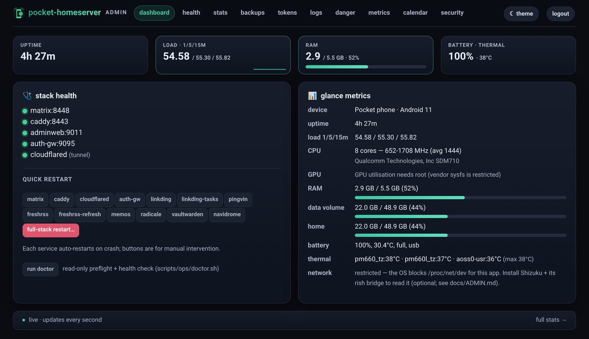

<div align="center">


# pocket-homeserver

**Turn a spare Android phone into a real, always-on server.**
A full Matrix chat homeserver plus a suite of self-hosted web apps —
with **no root, no public IP, and no monthly hosting bill.**

[](LICENSE)
[](https://github.com/Partha-dev01/pocket-homeserver/releases)
[](docs/SETUP.md)
[](CHANGELOG.md)

</div>

Everything runs in Termux on top of a proot Debian userland, and a **Cloudflare
Tunnel** handles ingress — so it works from behind CGNAT or mobile data with no
port-forwarding, no exposed IP, and no static address. It is productized from a
real, hardened deployment that ran a Matrix homeserver for ~20 users — alongside
a stack of supporting apps — on a single mid-range phone for months.

You drive the whole thing from **one interactive menu**:

<div align="center">


</div>

> **Status: v1.0.0 — stable.** Everything below has landed and been through a
> full pre-1.0 security + correctness audit. From here, breaking changes follow
> [SemVer](https://semver.org). See the [changelog](CHANGELOG.md).

## Features

- **A Matrix homeserver** — continuwuity / conduwuit behind Caddy, with the
  Element web client. Federation and open registration are off by default.
- **A catalog of optional web apps**, each on its own subdomain, all
  loopback-bound behind the single tunnel — the core set is bookmarks, file
  sharing, RSS, notes, tasks, metasearch, a developer toolbox, and a status page,
  with files & sync, productivity, media, and platform tiers below.
  ([docs/APPS.md](docs/APPS.md))
- **Personal cloud — files & sync** — serve your files over the web + WebDAV
  (Dufs, read-only by default) or with multi-user accounts + share links
  (FileBrowser), and sync folders peer-to-peer off the tunnel (Syncthing). All
  opt-in, loopback-bound. ([docs/FILES.md](docs/FILES.md))
- **Productivity & security apps** — a Bitwarden-compatible password manager
  (Vaultwarden), calendar + contacts over CalDAV/CardDAV (Radicale, with a QR
  connect-card in the panel), a notes/wiki (Trilium), and a read-later service
  (Wallabag). All opt-in; each keeps its DB on ext4. Native-auth clients
  (Bitwarden / DAV) use a Cloudflare Access service-token, not the login gate.
  ([docs/VAULT.md](docs/VAULT.md) · [docs/DAV.md](docs/DAV.md) ·
  [docs/NOTES.md](docs/NOTES.md) · [docs/READLATER.md](docs/READLATER.md))
- **Media apps** — stream your own music (Navidrome, Subsonic-compatible), read
  comics/manga/ebooks (Kavita), and play audiobooks + podcasts (Audiobookshelf). All
  opt-in; DB/cache on ext4, the bulk library on the SD; **direct-play by default** (no
  phone-melting transcode). Subsonic/OPDS/mobile API paths get a Cloudflare Access
  path-exemption. (A photo gallery is on the roadmap; Jellyfin is intentionally
  docs-only.) ([docs/MEDIA.md](docs/MEDIA.md))
- **Platform & networking (optional)** — a self-hosted **git forge** (Forgejo,
  `git.`), a filtering **DNS-over-HTTPS resolver** (AdGuard Home, `dns.`), a **BYO
  reverse-proxy** that puts any loopback service you run behind the tunnel on its own
  subdomain (`PROXY_ROUTES`, fail-closed loopback-only), a userspace **Tailscale**
  mesh VPN that sidesteps CGNAT (no public hostname — its tailnet ACL is the gate), an
  in-panel **app catalog** to enable + install modules from the browser, and an
  optional fail2ban-style **rate-jail** on the honeypot. All opt-in.
  ([docs/FORGEJO.md](docs/FORGEJO.md) · [docs/ADGUARD.md](docs/ADGUARD.md) ·
  [docs/PROXY_ROUTES.md](docs/PROXY_ROUTES.md) · [docs/TAILSCALE.md](docs/TAILSCALE.md))
- **One interactive control panel** (`./pocket.sh`) for the whole lifecycle —
  configure, install, status, restarts, backups, logs, and a panic stop.
- **Resumable installs** — every step is recorded, so re-runs are fast and an
  interrupted install picks up where it left off.
- **Pinned + updatable** — every component version lives in one manifest
  (`config/versions.env`); `pocket update` snapshots, bumps, verifies healthy, and
  **auto-rolls-back** on failure. A read-only `doctor` preflight and four CI gates
  (shellcheck / py_compile / leak-scan / `install --check`) guard every change.
  ([docs/UPDATING.md](docs/UPDATING.md))
- **Survives reboots and crashes** — a per-service supervisor respawns crashed
  services; a Termux:Boot launcher restarts the stack on boot; and a JobScheduler
  watchdog revives anything Android's low-memory killer takes down.
- **Backups, restore & rotation** — database and full-rootfs snapshots with
  retention and optional `age` encryption; a **scripted, dry-run-by-default
  restore**; one-command rotation of the admin password, registration token,
  tunnel token, OIDC signing key, and admin-bot token; and an optional
  **off-device encrypted push** to any S3-compatible bucket (R2 / B2 / S3 / …).
  ([docs/BACKUPS.md](docs/BACKUPS.md), [docs/RESTORE_AND_ROTATION.md](docs/RESTORE_AND_ROTATION.md))
- **Observability & alerts (optional)** — a tiny metrics sampler feeds the panel
  sparklines + a 24h health strip + a DEGRADED-aware *problems* view, and a
  crash-loop alert can ping ntfy / healthchecks / Matrix. ([docs/OBSERVABILITY.md](docs/OBSERVABILITY.md))
- **Matrix user management (optional)** — list / create / reset-password / suspend /
  deactivate users and mint invite tokens, from the panel or the CLI, driven through
  the homeserver's admin command room. ([docs/USERS.md](docs/USERS.md))
- **A web admin panel** — health, stats, logs, per-service restarts, backups,
  metrics, user management, and a guarded danger zone, over the tunnel. ([docs/ADMIN.md](docs/ADMIN.md))
- **Optional privacy & media filters** — hide chosen accounts from the member
  search, and fix untyped media so mobile clients render thumbnails. Two small
  loopback proxies, off by default, that fail open. ([docs/FILTERS.md](docs/FILTERS.md))
- **Optional one-shot Matrix bootstrap** — seed an admin account, a hub Space with
  rooms, and an admin-only announcements room, and mint single-use invite tokens.
  Idempotent, env-driven template, off by default. ([docs/BOOTSTRAP.md](docs/BOOTSTRAP.md))
- **Optional cloud-LLM chat bots** — Matrix bots that answer `@`-mentions via any
  OpenAI-compatible API (Groq's free tier, OpenRouter, …). No inbound listener,
  fail-closed rooms, free-tier-safe rate limits, off by default. ([docs/CHATBOTS.md](docs/CHATBOTS.md))
- **Optional on-phone LLM bot (advanced / BYO)** — run a model *on the device* with
  no cloud and no API key: bring your own llama.cpp build + GGUF, with an optional
  Gradio web UI. Off by default. ([docs/CHATBOTS.md](docs/CHATBOTS.md))
- **Optional sticker picker** — the Maunium stickerpicker widget (fetched, AGPL) +
  a native upload/Giphy backend + a DM-import bot, with signed per-user pack
  writes. Off by default. ([docs/STICKERS.md](docs/STICKERS.md))
- **Optional operator admin bot** — drive the stack from a private Matrix room
  (`!status`, `!users`, `!restart-stack`…); obeys only your MXID, fixed command
  table, no `shell=True`. Off by default. ([docs/ADMINBOT.md](docs/ADMINBOT.md))
- **Optional landing portal** — a clean service directory served at your apex
  domain, with one card per enabled app (generated from the `ENABLE_*` flags, no
  bait or decoy content). Off by default. ([docs/LANDING.md](docs/LANDING.md))
- **Optional email + webmail (advanced)** — a self-hosted mailbox (Maddy +
  loopback IMAP/SMTP) fed by a pull-based Cloudflare Email Routing → R2 → drain
  pipeline, with the SnappyMail webmail UI and optional Matrix-SSO login. You
  bring your own Cloudflare/R2/Resend. Off by default.
  ([docs/EMAIL.md](docs/EMAIL.md), [docs/WEBMAIL.md](docs/WEBMAIL.md))
- **Optional MCP server (advanced)** — a Model Context Protocol adapter so an MCP
  client (Claude Desktop / Claude Code / the claude.ai connector) can observe and
  operate the stack through a small, audited tool set. A thin front door to the
  existing `scripts/ops/*` — no new privileged code. Defaults to stdio over SSH
  (nothing published); an optional remote HTTP transport is fail-closed behind
  Cloudflare Access. Off by default. ([docs/MCP.md](docs/MCP.md))
- **Secure by construction** — no inbound ports, pinned + `sha256`-verified
  downloads, secrets kept off the command line, and a documented threat model.
  ([docs/SECURITY.md](docs/SECURITY.md))

## The web admin panel

The optional **web admin panel** (`admin/app.py`) is a small, loopback-only Flask
console, reached over the same tunnel and built phone-first. From any browser it
runs the day-two operations — health and live metrics, per-service restarts,
backups, credential rotation, and a guarded danger zone.

<div align="center">



<sub>The dashboard, served straight off the phone — real SoC, RAM, battery, and thermals, every service green. (Example deployment.)</sub>

</div>

More of the panel — sign-in, backups, and the danger zone — is in
[docs/ADMIN.md](docs/ADMIN.md).

## Requirements

- **A spare Android phone** you can leave plugged in (no root). A mid-range phone
  with ~3 GB RAM and a roomy SD card is plenty.
- **A domain name** whose DNS you can move to Cloudflare, and a **free Cloudflare
  account** (for the tunnel).
- **[Termux](https://termux.dev)** from F-Droid, plus the **Termux:Boot** and
  **Termux:API** addons (for reboot survival and the watchdog).

Full phone-side preparation is in [docs/SETUP.md](docs/SETUP.md).

## Quickstart

Prepare the phone and clone this repo into Termux (see [docs/SETUP.md](docs/SETUP.md)),
then run one command:

```bash
./pocket.sh
```

First run, pick **Configure** (it interviews you and writes a `0600` `.env` — your
secrets are never echoed), then **Install**. That's it.

Prefer the command line? The menu just runs these, and you can too:

```bash
./setup.sh            # guided wizard → writes a complete .env
./scripts/install.sh  # bring the whole stack up (resumable + idempotent)
```

## The control panel (`./pocket.sh`)

A plain text menu — no extra packages, works over SSH and in Termux as-is. Each
item runs a script you could run by hand, so nothing is hidden:

| Menu item | What it does | Underlying command |
|---|---|---|
| **Configure / reconfigure** | guided setup, writes `.env` | `./setup.sh` |
| **Install / bring up the stack** | install + start everything (resumes) | `scripts/install.sh` |
| **Re-run everything (force)** | redo every install step | `scripts/install.sh --force` |
| **Status** | what's installed and what's running | `scripts/install.sh --status` |
| **Restart a service** | restart one service | `scripts/ops/restart.sh <svc>` |
| **Backups & restore** | DB / full snapshots, retention, off-device push, restore | `scripts/ops/backup-*.sh` · `restore.sh` |
| **View logs** | tail any service log | — |
| **Stop / panic** | cut public access, or stop everything | `scripts/ops/panic-*.sh` |
| **Rotate credentials** | admin pw / registration + tunnel token / OIDC key | `scripts/ops/rotate-*.sh` |
| **Update components** | bump a pinned version, verify-healthy, auto-rollback | `scripts/ops/update.sh` |
| **Doctor / diagnostics** | read-only preflight + health self-test | `scripts/ops/doctor.sh` |

## Run it again, any time

The installer **remembers what's already done.** Each completed step is recorded
on your data volume, so:

- **Re-runs are quick** — completed steps are skipped (config rendering and the
  stack bring-up always run, so things actually come up).
- **An interrupted install resumes** exactly where it stopped.
- **One command restores everything** — `scripts/install.sh` (or the menu's
  *Install*) re-supervises the core stack and every installed app, so after a
  reboot the whole stack comes back. With reboot survival enabled, that happens
  automatically.
- `scripts/install.sh --status` shows it all; `--force` redoes everything;
  `--reset` forgets the markers. Changed your domain or an app's settings in
  `.env`? Re-run with **force** so the install steps pick it up.

## How it works

```
 internet → Cloudflare edge → (mutually-authenticated tunnel) → cloudflared
          → Caddy (loopback HTTP edge) → Matrix / the apps (all on 127.0.0.1)
```

The phone never opens an inbound port; it only dials out to Cloudflare, which
terminates public TLS and forwards to a local Caddy that fronts every service on
loopback. Full detail in [docs/ARCHITECTURE.md](docs/ARCHITECTURE.md).

**"Is it really self-hosted if it uses Cloudflare?"** Every service and all your
data run on the phone, bound to loopback — Cloudflare only terminates public TLS
at the edge and forwards the connection down the tunnel; it never stores your
data. The tunnel is the **default** purely because it's what makes a phone with
no public IP, behind CGNAT, reachable at all. You are not locked into it: Caddy
already fronts every service locally, so if you have a routable or static IP you
can point your own reverse proxy or DNS straight at it and drop Cloudflare
entirely. It is a swappable ingress default, not a hard dependency.

**Why a phone?** A retired phone is a low-power, battery-backed, always-on ARM64
computer with storage and (optionally) a SIM. Paired with a Cloudflare Tunnel, it
serves real HTTPS traffic from anywhere without a static IP — a cheap, resilient,
genuinely practical way to self-host.

## Documentation

- [docs/SETUP.md](docs/SETUP.md) — zero-to-running setup guide.
- [docs/ARCHITECTURE.md](docs/ARCHITECTURE.md) — layers, request flow, components, storage.
- [docs/SECURITY.md](docs/SECURITY.md) — threat model, layered defenses, operator checklist.
- [docs/APPS.md](docs/APPS.md) — the optional apps: what each is, where its data lives, how to enable/upgrade.
- [docs/APP_AUTH.md](docs/APP_AUTH.md) — how apps are protected: Cloudflare Access (default), service tokens for native clients, and the optional Matrix-SSO gateway.
- [docs/FILES.md](docs/FILES.md) — personal cloud: files & sync (Dufs / FileBrowser / Syncthing; why not Nextcloud/SMB).
- [docs/VAULT.md](docs/VAULT.md) — Vaultwarden password manager (incl. the image-extract supply-chain note).
- [docs/DAV.md](docs/DAV.md) — Radicale calendar + contacts (CalDAV/CardDAV) + the QR connect-card.
- [docs/NOTES.md](docs/NOTES.md) — Trilium notes / wiki.
- [docs/READLATER.md](docs/READLATER.md) — Wallabag read-later / article saver.
- [docs/MEDIA.md](docs/MEDIA.md) — media apps (Navidrome / Kavita / Audiobookshelf), the photo-gallery roadmap note, and why Jellyfin is docs-only.
- [docs/FORGEJO.md](docs/FORGEJO.md) — the optional Forgejo git forge (loopback bind, service-token for git-HTTP/API/LFS).
- [docs/ADGUARD.md](docs/ADGUARD.md) — the optional AdGuard Home DoH-over-tunnel resolver (and why it can't be a LAN `:53` sinkhole).
- [docs/PROXY_ROUTES.md](docs/PROXY_ROUTES.md) — the BYO reverse-proxy module (publish any loopback service on its own subdomain, fail-closed loopback-only).
- [docs/TAILSCALE.md](docs/TAILSCALE.md) — the optional userspace Tailscale mesh VPN (CGNAT sidestep; the tailnet-bypasses-the-edge trust boundary).
- [docs/ADMIN.md](docs/ADMIN.md) — the web admin panel (incl. the optional app catalog / module manager).
- [docs/OBSERVABILITY.md](docs/OBSERVABILITY.md) — the optional metrics sampler, admin sparklines + 24h health strip, and crash-loop alerts (ntfy / healthchecks / Matrix).
- [docs/USERS.md](docs/USERS.md) — Matrix user management from the admin panel (create / disable / reset / invite via the admin command room).
- [docs/BACKUPS.md](docs/BACKUPS.md) — snapshots, retention, encryption, restore.
- [docs/RESTORE_AND_ROTATION.md](docs/RESTORE_AND_ROTATION.md) — the scripted restore and the credential-rotation scripts.
- [docs/UPDATING.md](docs/UPDATING.md) — the pinned-version manifest and the snapshot → bump → verify-healthy → auto-rollback update flow.
- [docs/RESILIENCE.md](docs/RESILIENCE.md) — crash-respawn supervision, the circuit breaker / DEGRADED markers, DB-corruption recovery, and reboot survival.
- [docs/BOOTSTRAP.md](docs/BOOTSTRAP.md) — the optional one-shot Matrix bootstrap (admin, Space/rooms, invite tokens).
- [docs/CHATBOTS.md](docs/CHATBOTS.md) — the optional Matrix chat bots (cloud-LLM, and the on-phone BYO model).
- [docs/STICKERS.md](docs/STICKERS.md) — the optional sticker picker (widget + backend + import bot).
- [docs/ADMINBOT.md](docs/ADMINBOT.md) — the optional operator admin bot (Matrix ops bot + panel widget).
- [docs/LANDING.md](docs/LANDING.md) — the optional landing portal (apex service directory, generated from enabled apps).
- [docs/EMAIL.md](docs/EMAIL.md) — the optional email backend (Maddy + the Cloudflare Email Routing → R2 → drain pipeline).
- [docs/WEBMAIL.md](docs/WEBMAIL.md) — the optional SnappyMail webmail UI + Matrix-SSO login plugin.
- [docs/MATRIX_AUTH_GW.md](docs/MATRIX_AUTH_GW.md) — the optional single sign-on gateway in depth.
- [docs/MCP.md](docs/MCP.md) — the optional MCP server: connecting a client, the tool set, the tiers, and the security model.
- [docs/MCP_SERVER_SPEC.md](docs/MCP_SERVER_SPEC.md) — the MCP server's as-built design specification (tool table, transports, threat model).
- [docs/HONEYPOT.md](docs/HONEYPOT.md) — the optional honeypot / scanner-detection surface (alert-only by default; admin Security console).
- [docs/ROADMAP.md](docs/ROADMAP.md) — the shipped-feature ledger and the short list of what is still planned.

## Repository layout

```
pocket.sh    the interactive control panel (start here)
setup.sh     the guided config wizard (writes .env)
.env.example the single config file, documented
scripts/     idempotent install, service, watchdog, and ops scripts
admin/       the web admin panel
docs/        architecture, security, setup, and per-subsystem guides
tools/       repo tooling (e.g. the leak-scan pre-push guard)
```

## Roadmap

pocket-homeserver is **feature-complete as of v1.0.0**. The full ledger of shipped
features and the short list of what is still planned (a loopback-safe photo
gallery) lives in **[docs/ROADMAP.md](docs/ROADMAP.md)**; per-release detail is in
the **[CHANGELOG](CHANGELOG.md)**.

## Status, license, and contributing

Stable (v1.0.0). Breaking changes follow [SemVer](https://semver.org) from here.
Licensed under the [MIT License](LICENSE). Issues, bug reports, and discussion are
welcome — see [CONTRIBUTING.md](CONTRIBUTING.md). Because the repo is public, every
change is scanned for secrets and deployment-specific data by
[`tools/leak-scan.sh`](tools/leak-scan.sh) before it lands.
